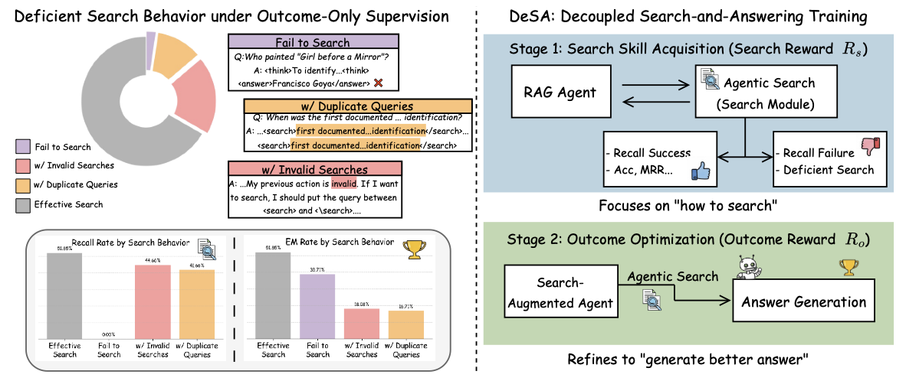
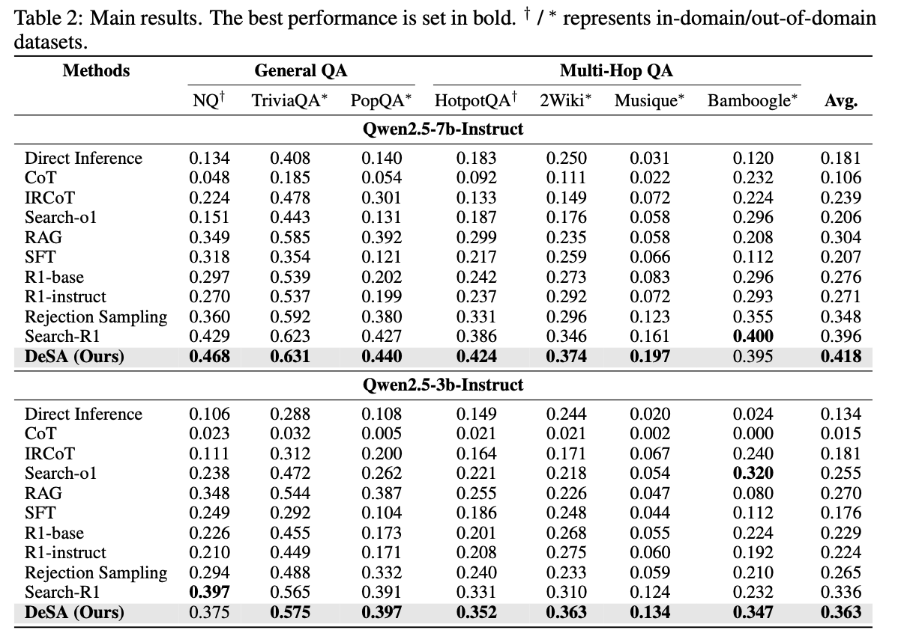

# Beyond Outcome Reward: Decoupling Search and Answering (DeSA) Improves LLM Agents

**DeSA** (Decoupling Search and Answering) is a novel two-stage training framework that improves LLM agents by separating the search and answering phases during training. This approach is built upon the [Search-R1](https://github.com/PeterGriffinJin/Search-R1) codebase, which provides a reinforcement learning framework for training reasoning-and-searching interleaved LLMs.

Our method addresses the limitations of traditional outcome-based reward systems by providing more granular feedback during both the search and answering phases, leading to improved performance in question-answering tasks.



## Overview

DeSA introduces a two-stage training approach that decouples the search and answering phases in RAG systems:

- **Stage 1**: Focus on training the model's search capabilities with search rewards
- **Stage 2**: Train the answering phase with outcome rewards

This decoupled approach allows for more targeted training and improved performance compared to traditional outcome-only reward methods.

## Table of Contents

- [Beyond Outcome Reward: Decoupling Search and Answering (DeSA) Improves LLM Agents](#beyond-outcome-reward-decoupling-search-and-answering-desa-improves-llm-agents)
  - [Overview](#overview)
  - [Table of Contents](#table-of-contents)
  - [Installation](#installation)
    - [Main environment](#main-environment)
    - [Retriever environment (optional)](#retriever-environment-optional)
  - [Two-Stage Training](#two-stage-training)
    - [Stage 1: Search Skill Acquisition](#stage-1-search-skill-acquisition)
    - [Stage 2: Outcome Optimization](#stage-2-outcome-optimization)
    - [Switching Reward Functions Between Stages](#switching-reward-functions-between-stages)
  - [Quick Start](#quick-start)
  - [Results](#results)
  - [Use your own dataset](#use-your-own-dataset)
    - [QA data](#qa-data)
    - [Corpora](#corpora)
  - [Acknowledgments](#acknowledgments)
  - [Citations](#citations)

## Installation

### Main environment
```bash
conda create -n desa python=3.9
conda activate desa
# install torch [or you can skip this step and let vllm to install the correct version for you]
pip install torch==2.4.0 --index-url https://download.pytorch.org/whl/cu121
# install vllm
pip3 install vllm==0.6.3 # or you can install 0.5.4, 0.4.2 and 0.3.1

# verl
pip install -e .

# flash attention 2
pip3 install flash-attn --no-build-isolation
pip install wandb
```

### Retriever environment (optional)
If you would like to call a local retriever as the search engine, you can install the environment as follows. (We recommend using a seperate environment.)
```bash
conda create -n retriever python=3.10
conda activate retriever

# we recommend installing torch with conda for faiss-gpu
conda install pytorch==2.4.0 torchvision==0.19.0 torchaudio==2.4.0 pytorch-cuda=12.1 -c pytorch -c nvidia
pip install transformers datasets pyserini

## install the gpu version faiss to guarantee efficient RL rollout
conda install -c pytorch -c nvidia faiss-gpu=1.8.0

## API function
pip install uvicorn fastapi
```


## Two-Stage Training

DeSA employs a novel two-stage training framework that decouples search and answering phases for more targeted learning.

### Stage 1: Search Skill Acquisition

In the first stage, we focus exclusively on training the model's search capabilities:

- **Objective**: Learn to generate effective search queries and retrieve relevant information
- **Reward Signal**: Search-specific rewards based on retrieval recall
- **Training Script**: `desa_scripts/train_qwen3b_stage1.sh`

```bash
conda activate desa
bash desa_scripts/train_qwen3b_stage1.sh
```

**Key Features of Stage 1:**
- Search query generation optimization
- Retrieval relevance maximization
- Search strategy learning

### Stage 2: Outcome Optimization

In the second stage, we train the answering capabilities using the search-enhanced model from Stage 1:

- **Objective**: Learn to synthesize retrieved information into accurate and comprehensive answers
- **Reward Signal**: Answer-specific rewards based on Exact Match (EM) correctness.
- **Training Script**: `desa_scripts/train_qwen3b_stage2.sh`

```bash
conda activate desa
bash desa_scripts/train_qwen3b_stage2.sh
```

**Key Features of Stage 2:**
- Answer generation from retrieved content
- Information synthesis and reasoning
- Factual accuracy optimization

### Switching Reward Functions Between Stages

**Important**: The key to DeSA's success lies in using different reward functions for each stage. You need to modify the reward function in `verl/trainer/main_ppo.py` when switching between stages:

**Stage 1 - Search Training (Recall Reward):**
```python
def _select_rm_score_fn(data_source):
    if data_source in ['nq', 'triviaqa', 'popqa', 'hotpotqa', '2wikimultihopqa', 'musique', 'bamboogle']:
        return qa_search.compute_score_em  # Uses recall-based reward for search quality
```

**Stage 2 - Answer Training (EM Reward):**
```python
def _select_rm_score_fn(data_source):
    if data_source in ['nq', 'triviaqa', 'popqa', 'hotpotqa', '2wikimultihopqa', 'musique', 'bamboogle']:
        return qa_em.compute_score_em  # Uses exact match reward for answer accuracy
```

**Explanation:**
- **Stage 1** (`qa_search`): Focuses on search recall. 
- **Stage 2** (`qa_em`): Focuses on answer accuracy using exact match scoring. 

This decoupled reward design allows each stage to optimize for its specific objective, leading to better overall performance than joint training with a single reward function.

## Quick Start

Here's a complete example of training a DeSA model on the NQ dataset with e5 as the retriever and Wikipedia as the corpus.

(1) Download the indexing and corpus.
```bash
save_path=/the/path/to/save
python scripts/download.py --save_path $save_path
cat $save_path/part_* > $save_path/e5_Flat.index
gzip -d $save_path/wiki-18.jsonl.gz
```

(2) Process the NQ dataset.
```bash
python scripts/data_process/nq_search.py
```

(3) Launch a local retrieval server.
```bash
conda activate retriever
bash retrieval_launch.sh
```

(4) Run two-stage DeSA training with Qwen2.5-3b-instruct.
```bash
conda activate desa
# Stage 1: Search training
bash desa_scripts/train_qwen3b_stage1.sh

# Modify the reward function in `verl/trainer/main_ppo.py`

# Stage 2: Answer training (after Stage 1 completes)
bash desa_scripts/train_qwen3b_stage2.sh
```

## Results

DeSA demonstrates significant improvements over traditional outcome-only reward methods:

**Key Findings:**
- **Improved Search Quality**: Stage 1 training leads to more effective search queries and better retrieval performance
- **Enhanced Answer Accuracy**: Stage 2 training with search-specific rewards improves answer correctness and completeness
- **Better Convergence**: Decoupled training shows more stable learning curves compared to joint training approaches

**Performance Metrics:**
- Superior performance on question-answering benchmarks
- Better recall quality



## Use your own dataset

### QA data
For each question-answer sample, it should be a dictionary containing the desired content as below:

```
data = {
        "data_source": data_source,
        "prompt": [{
            "role": "user",
            "content": question,
        }],
        "ability": "fact-reasoning",
        "reward_model": {
            "style": "rule",
            "ground_truth": solution
        },
        "extra_info": {
            'split': split,
            'index': idx,
        }
    }
```

You can refer to ```scripts/data_process/nq_search.py``` for a concrete data processing example.

### Corpora

It is recommended to make your corpus a jsonl file, where each line (a dictionary with "id" key and "contents" key) corresponds to one passage. You can refer to ```example/corpus.jsonl``` for an example.

The "id" key corresponds to the passage id, while the "contents" key corresponds to the passage content ('"' + title + '"\n' + text).
For example:
```
{"id": "0", "contents": "Evan Morris Evan L. Morris (January 26, 1977 \u2013 July 9, 2015) was a lobbyist for Genentech and its parent corporation Roche in Washington."}
...
{"id": "100", "contents": "Three years later, when the United States Exploring Expedition to little-known portions of the globe was organised under Charles Wilkes, Hale was recommended, while yet an undergraduate."}
...
```

**Index your corpora (optional).**
If you would like to use a local retriever as the search engine, you can index your own corpus by:
```
bash search_r1/search/build_index.sh
```
You can change ```retriever_name``` and ```retriever_model``` to your interested off-the-shelf retriever.

## Acknowledgments

DeSA is built upon the [Search-R1](https://github.com/PeterGriffinJin/Search-R1) codebase, which provides the foundational framework for training reasoning-and-searching interleaved LLMs. We extend our gratitude to the Search-R1 team for their open-source contributions.

The implementation leverages [veRL](https://github.com/volcengine/verl) for reinforcement learning capabilities. We also acknowledge the inspiration from [DeepSeek-R1](https://github.com/deepseek-ai/DeepSeek-R1) and other related work in the field.


## Citations

If you find DeSA useful in your research, please cite:


We also acknowledge the foundational work of Search-R1:

```bibtex
@article{jin2025search,
  title={Search-r1: Training llms to reason and leverage search engines with reinforcement learning},
  author={Jin, Bowen and Zeng, Hansi and Yue, Zhenrui and Yoon, Jinsung and Arik, Sercan and Wang, Dong and Zamani, Hamed and Han, Jiawei},
  journal={arXiv preprint arXiv:2503.09516},
  year={2025}
}
```
